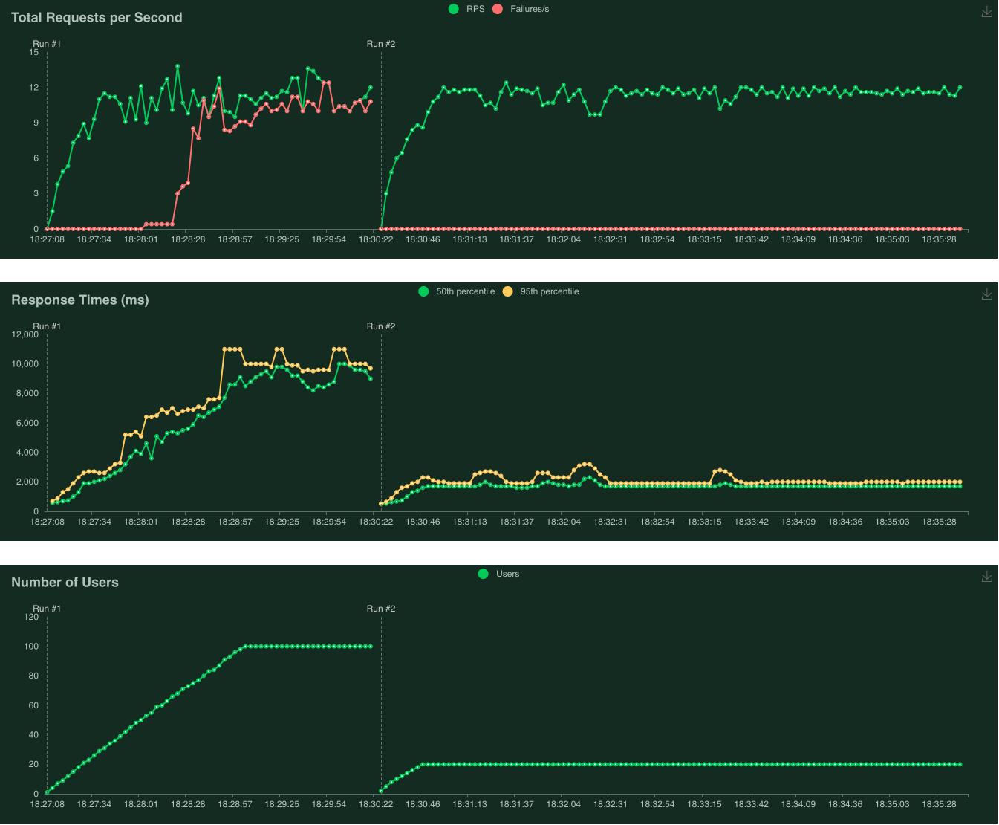

# How to run and test ray serve over the yolo_v7 model on GPU

## Running a Ray Serve Application
- Use requirements.txt to install dependencies
- Upload [**YOLOv7 weights**](https://github.com/WongKinYiu/yolov7/releases/download/v0.1/yolov7.pt) to the yolo_v7 folder 
- OR you can upload your own weights for the yolo_v7 model BUT you need to change file name in object_detector_serve.py
- Start a Ray Cluster: 
```bash
ray start --head --port=6379
```
**Note:** The following code was added to the yolo_v7/models/experimental.py for correct imports
```
import sys
sys.path.append('/data/dianakapatsyn/ray_pipeline/yolo_v7/')
```
- Start a Ray Serve app:
```bash
serve run object_detector_serve:detector
```

## How restart a Ray Serve Application
- Stop a Ray Cluster and all running processes:
```bash
ray stop
```
- Start a Ray Cluster: 
```bash
ray start --head --port=6379
```
- Start a Ray Serve app:
```bash
serve run object_detector_serve:detector
```

## Process images with a Ray Serve Application

Processing consists of 3 steps:
1. Cropping images of arbitrary size into equal-sized patches (by default 512x512)
2. Predicting bounded boxes on patches using Ray serve with batch handler over yolo_v7 model
3. Converting bounded boxes coordinates to GeoJson format and saving file (for each image separately or united for all images)

- Run the following command to process images:

    - save geojson for each image separately
    ```
    python object_detector_client.py --input_dir /data/dianakapatsyn/ray_pipeline/input_images/ --output_dir /data/dianakapatsyn/ray_pipeline/output_geojsons/
    ```
    - save united geojson
    ```
    python object_detector_client.py --input_dir /data/dianakapatsyn/ray_pipeline/input_images/ --output_dir /data/dianakapatsyn/ray_pipeline/output_geojsons/ --united_geojson
    ```

## Test a Ray Serve Application over HTTP

### Test connection and output format:
- While detector is running, open a separate terminal window
- Run the client script:
```bash
python object_detector_test_client.py
```

### Load Testing using Locust
- While detector is running, open a separate terminal window
- Run the following command:
```bash
locust -f locust_test.py
```

## Results of Load Testing
| batch_size | throughput (rps) | latency 50th perc (ms per image) | latency 95th perc (ms per image) |
| :-- | :-: | :-: | :-: |
| 32 | 11 | 85 | 95 |

<div align="center">
    <a href="./">
        
    </a>
</div>

**You can find detailed results of the experiments in the [**Google sheet**](https://docs.google.com/spreadsheets/d/1MJICCQJi-ZQDgATnPMgaednYdPSER0w4kr_0yPJeuj0/edit?usp=sharing)**
